# StuffIt Test Files

This repository contains a collection of minimal, legally redistributable
StuffIt archives suitable for inclusion in test suites for programs that
incorporate StuffIt extraction functionality.

**See Also:** [RAR Test Files](https://github.com/ssokolow/rar-test-files)

## Explain

Since there are no free tools I know of for creating
[StuffIt](https://en.wikipedia.org/wiki/StuffIt) archives, and it's important to
be able to integration-test systems that use `lsar` and `unar` from The
Unarchiver's open-source
[command-line tools](https://theunarchiver.com/command-line) to process legacy
archives, I decided to step up and create some legally redistributable StuffIt
test files.

To ensure the correct file format versions, the procedure I follow is:

- For Windows versions of StuffIt, each version was installed in its own fresh
  Wine prefix to ensure they couldn't see each other's DLLs.
- For MacOS versions of StuffIt, I replaced the hard drive in my Power Mac G4
  with an IDE-to-SD Card converter and used a fresh SD card with a clean MacOS
  9.2 or MacOS X 10.1.3 install for each version, and I double-checked that
  there were no Sherlock matches for "Aladdin", "Drop", "Expander", or "Stuff"
  before I installed StuffIt. (Photo was taking during the process of making
  earlier versions of the test files.)

## Usage

1. The test archives are in the `build` folder.
2. The password for all password-protected test files is `password`.

## "How Do I Know These Are Legal?"

First, the contents are the same test files I created from scratch and released
into the public domain for my
[RAR test files](https://github.com/ssokolow/rar-test-files) repository, plus
Netatalk representations of a PICT, Finder Picture, and SimpleText file created
from them on my Power Mac G4 to ensure that the StuffIt files originating from a
Macintosh contain test examples of resource forks.

The PICT and Finder Picture files were created using a copy of GraphicConverter
5.9.5 for Classic MacOS that has been registered using a license key
[now given away for free](https://www.lemkesoft.de/en/products/graphicconverter/download/download-old-versions/)
by the original developer.

As for the archives, while Smith Micro Software doesn't sell StuffIt anymore, I
bought a bunch of copies, including registration keys, off eBay (including a New
Old Stock one) and their license agreements are transferable so long as the
seller doesn't keep any copies and Macintosh-originated test archives were
created entirely on my Power Mac G4 to be absolutely sure that the HFS
Creator/Type codes would be intact.

The Macintosh-originated archive have had `testfile.txt` converted to use
Macintosh-style line endings.

**NOTE:** Currently, I believe my copy of Netatalk 3.x is configured to use
POSIX Extended Attributes in addition to AppleDouble-style `._` files, which
means some of the data present in the StuffIt archives created on the mac is
missing from the `sources` folder. (At the very least, probably HFS Creator/Type
codes.)

I'll try to resolve this later but, as the relevant files were _created_ on the
Macintosh, using the copies from the StuffIt archives should be a perfectly fine
workaround for now.

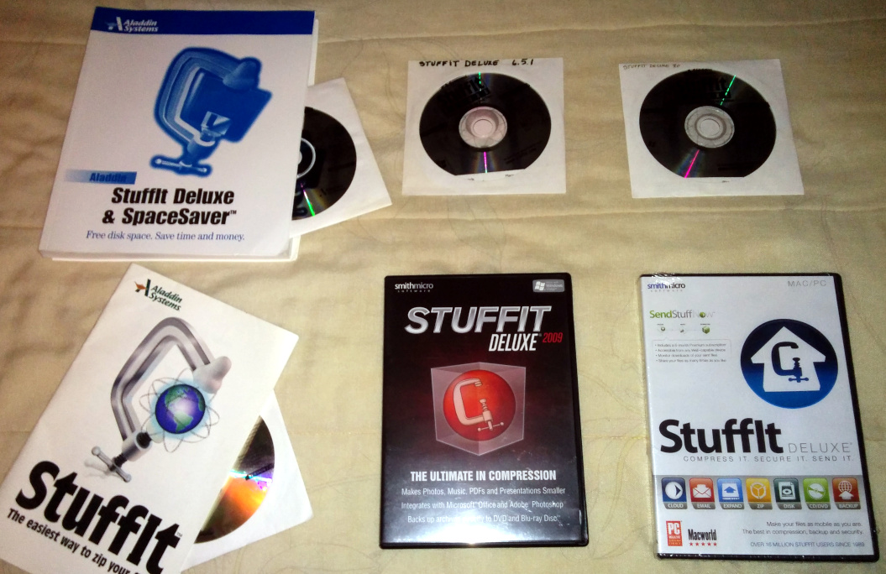

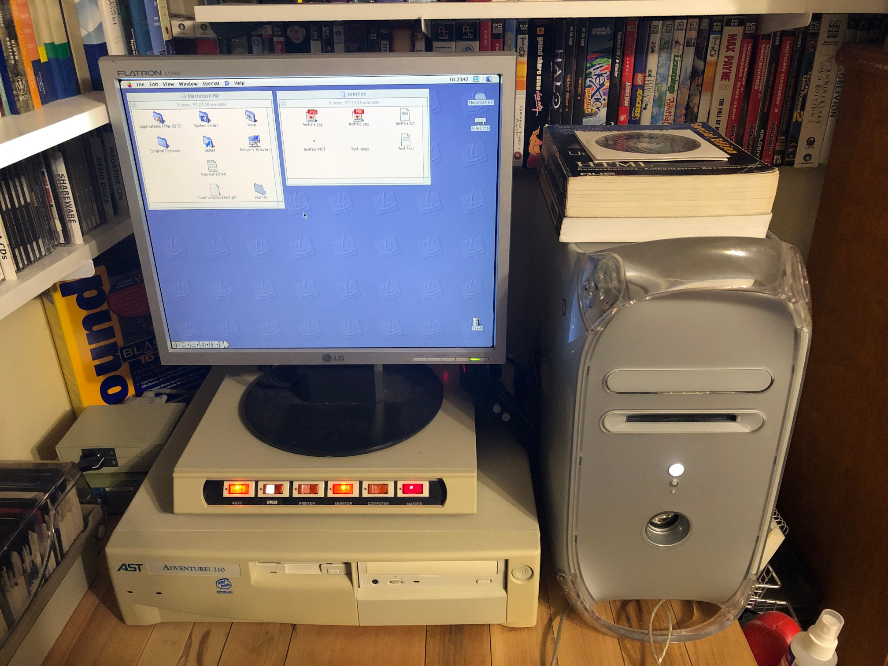

**NOTE:** Image of Power Mac G4 is a composite due to the wildly different
exposure settings needed to capture both the screen contents and the hardware
well. See the `source_photos` folder for originals.

**The versions I have licenses for are:**

- StuffIt Deluxe 4.5 for 68k Macintosh
- StuffIt Deluxe 6.5 for PPC Macintosh
- StuffIt Deluxe 7.0 for PPC Macintosh
- StuffIt 7.0 for Windows
- StuffIt Deluxe 9.5 for Windows (not pictured in combined photo)
- StuffIt Deluxe 2009 for Windows
- StuffIt Deluxe 2011 for Windows and OSX (2010 for Windows, 2011 for OSX,
  **Sealed/New Old Stock**)

Sorry about the photo quality. I don't have a proper lighting setup or anything
else which would allow me to take good photos of these things, and I felt that
putting them on my scanner would make them look too much like stock photos I
might have found lying around on the web.

**NOTE:** Boldface emphasis on all license excerpts is mine.

### StuffIt Deluxe 4.5 for Macintosh

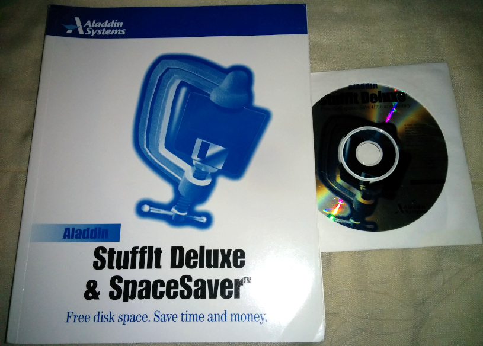

The license is included in the back of the print manual and is as follows:

**Relevant License Terms:**

> 3. OTHER RESTRICTIONS. You may not rent or lease the SOFTWARE, but **you may
>    transfer the SOFTWARE and accompanying written materials on a permanent
>    basis provided you retain no copies and the recipient agrees to the terms
>    of this agreement**. [...]

### StuffIt Deluxe 6.5 for Macintosh

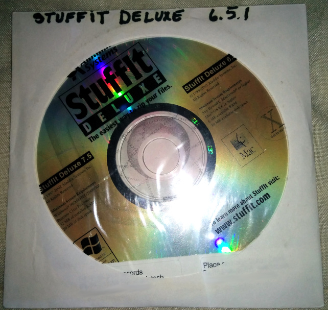

I got this as part of the same lot as 4.5 for Macintosh.

In the absence of terms making any mention of transferring the license, this
passage of the license should mean that it's legal to buy and sell licenses for
StuffIt Deluxe 6.5 for Macintosh as long as the seller uninstalls it before
selling the install media and destroys any backup copies they've made.

> The Software is owned by Aladdin Systems and is protected by United States
> copyright laws and international treaty provisions. **Therefore, you must
> treat the Software like any other copyrighted material (e.g., a book or
> musical recording).** Paying the license fee allows you the right to use one
> copy of the Software on a single computer. You may not network the Software or
> otherwise use it or make it available for use on more than one computer at the
> same time. You may not rent or lease the Software, nor may you modify, adapt,
> translate, reverse engineer, decompile, or disassemble the Software. If you
> violate any part of this agreement, your right to use this Software terminates
> automatically and you must then destroy all copies of the Software in your
> possession.

**NOTE:** The included license key for StuffIt Deluxe 6.5 for Macintosh does not
work for the copy of StuffIt Deluxe 7.5 for Windows that's also on the disk.
This is explicitly made clear in the "Read Me First" file on the disc.

### StuffIt Deluxe 7.0 for Macintosh

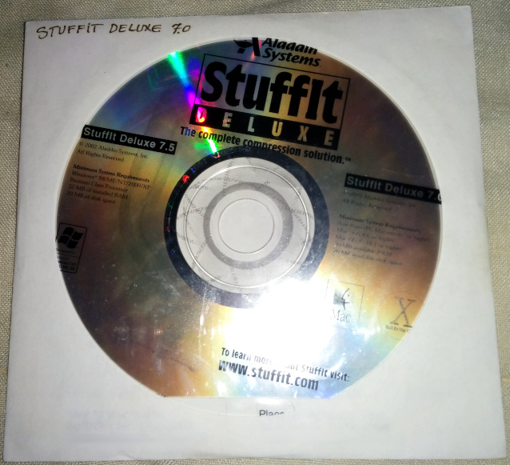

I got this as part of the same lot as 4.5 for Macintosh.

In the absence of terms making any mention of transferring the license, this
passage of the license should mean that it's legal to buy and sell licenses for
StuffIt Deluxe 7.0 for Macintosh as long as the seller uninstalls it before
selling the install media and destroys any backup copies they've made.

> The Software is owned by Aladdin Systems and is protected by United States
> copyright laws and international treaty provisions. **Therefore, you must
> treat the Software like any other copyrighted material (e.g., a book or
> musical recording).** Paying the license fee allows you the right to use one
> copy of the Software on a single computer. You may not network the Software or
> otherwise use it or make it available for use on more than one computer at the
> same time. You may not rent or lease the Software, nor may you modify, adapt,
> translate, reverse engineer, decompile, or disassemble the Software. If you
> violate any part of this agreement, your right to use this Software terminates
> automatically and you must then destroy all copies of the Software in your
> possession.

**NOTE:** The included license key for StuffIt Deluxe 7.0 for Macintosh does not
work for the copy of StuffIt Deluxe 7.5 for Windows that's also on the disk.

### StuffIt 7.0 for Windows

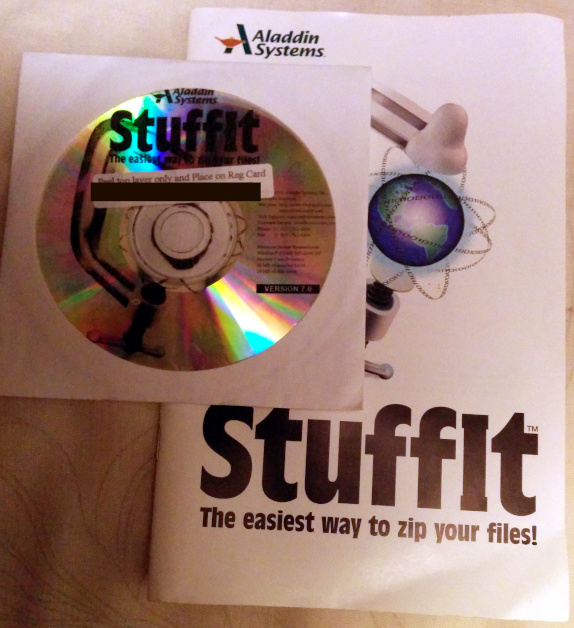

**Relevant License Terms:**

> [...] BY USING THE SOFTWARE (REGARDLESS IF YOU HAVE REGISTERED THE SOFTWARE OR
> NOT), YOU ARE AGREEING TO BE BOUND BY THE TERMS OF THIS AGREEMENT [...]
>
> The Software is owned by Aladdin Systems and is protected by United States
> copyright laws and international treaty provisions. **Therefore, you must
> treat the Software like any other copyrighted material (e. g., a book or
> musical recording).** Paying the license fee allows you the right to use one
> copy of the Software on a single computer. You may not network the Software or
> otherwise use it or make it available for use on more than one computer at the
> same time. You may not rent or lease the Software, nor may you modify, adapt,
> translate, reverse engineer, decompile, or disassemble the Software. If you
> violate any part of this agreement, your right to use this Software terminates
> automatically and you must then destroy all copies of the Software in your
> possession.
>
> [...]
>
> SPECIAL NOTE: MulitVolume self-extracting ZIP archives with extensions .z00,
> .z01,..., are registered and under copyright to Aladdin Systems.
> **Distribution of programs for revenue made with StuffIt SFX ZIP archives
> using this software requires a license from Aladdin Systems. Inc.**

---

> If you do not have a serial number, StuffIt will install in "Demo" mode.

In the absence of additional terms to the contrary, "like any other copyrighted
material (e. g., a book or musical recording)" should mean that it's legal to
buy and sell licenses for StuffIt 7.0 for Windows as long as the seller
uninstalls it before selling the install media and destroys any backup copies
they've made.

Also, you're not allowed to distribute StuffIt 7.0 Zip self-extractors for
profit without a license and I'm unsure whether registering your StuffIt 7.0 is
the license being referred to. This should be irrelevant since this repository
is for SIT/SITX self-extractors, not Zip ones.

### StuffIt Deluxe 9.5 for Windows

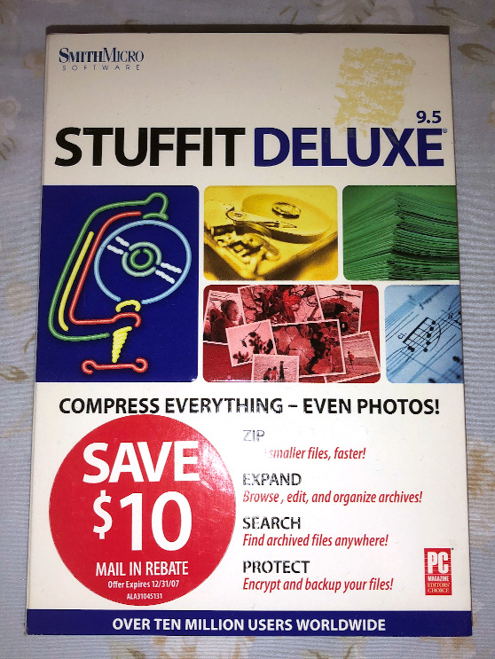

This was purchased later and, as such, is not included in the combined photo.

**Relevant License Terms:**

> You may, however, transfer your rights under this License provided you
> transfer the related documentation, this License and a copy of the Software to
> a party who agrees to accept the terms of this License and destroy any other
> copies of the Software in your possession.

### StuffIt Deluxe 2009 for Windows

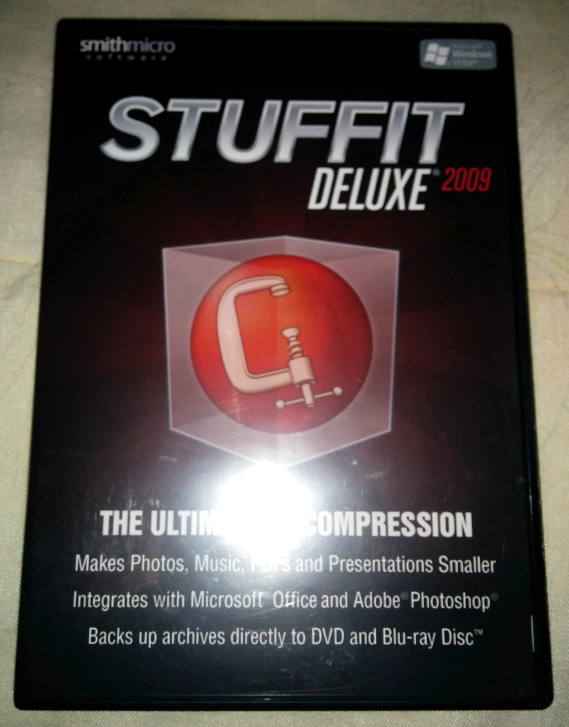

**Relevant License Terms:**

> Except as permitted by applicable law and this EULA, you will not use, copy,
> modify, distribute, or create derivative works from the Software or
> Documentation or transfer the Software or Documentation, and you will not (and
> will not permit any third party to) decompile, reverse engineer, disassemble,
> rent, lease, or loan the Software. **You may, however, transfer your rights
> under this EULA provided you transfer the related Documentation, this EULA and
> a copy of the Software to a party who agrees to accept the terms of this EULA
> and provided you destroy all copies of the Software (or portions thereof)
> remaining in your possession.** In addition, you may transfer your rights
> under this EULA solely in accordance with any written instructions that the
> Company provides in connection with the Software.

### StuffIt Deluxe 2010 for Windows

I received this copy as sealed New Old Stock.

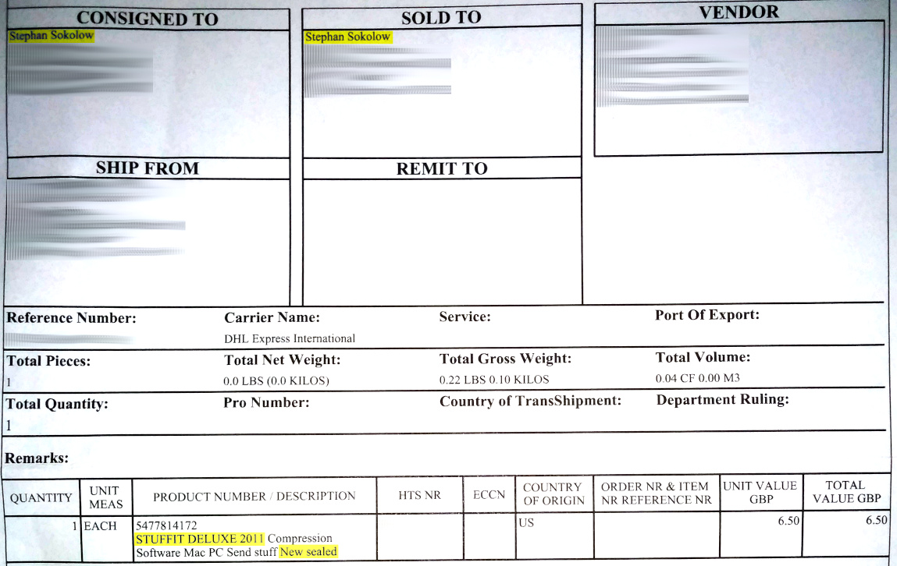

(Sorry for the quality. Upgrading my OS broke my scanner and I haven't had time
to track down a solution, so I just had to take a photo.)

There is no StuffIt Deluxe 2011 for Windows, so this Stuffit Deluxe 2011 hybrid
CD contains Stuffit Deluxe 2010 for Windows users.

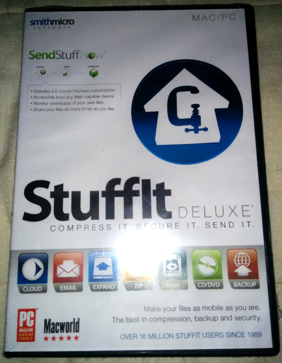 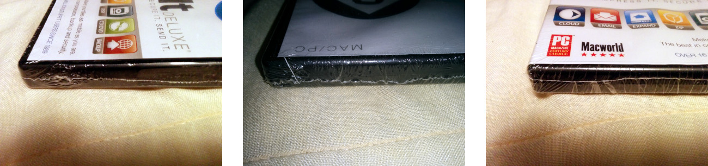

While I bought this as New Old Stock, the clause in the license which would
allow me to have purchased it used is still present:

> Except as permitted by applicable law and this EULA, you will not use, copy,
> modify, distribute, or create derivative works from the Software or
> Documentation or transfer the Software or Documentation, and you will not (and
> will not permit any third party to) decompile, reverse engineer, disassemble,
> rent, lease, or loan the Software. **You may, however, transfer your rights
> under this EULA provided you transfer the related Documentation, this EULA and
> a copy of the Software to a party who agrees to accept the terms of this EULA
> and provided you destroy all copies of the Software (or portions thereof)
> remaining in your possession.** In addition, you may transfer your rights
> under this EULA solely in accordance with any written instructions that the
> Company provides in connection with the Software.

## "My virus scanner reports malware in these files"

Check them on [VirusTotal](https://virustotal.com/). Lazy antivirus software has
a tendency to assume self-extracting archives or UPX-packed executables are
inherently malicious, and StuffIt self-extractors tick both boxes, so I'd be
_very_ surprised if it wasn't a false positive.

As of the time these files were created...

1. [`testfile.stuffit7_dlx.mac9.exe`](https://www.virustotal.com/gui/file/2adcfce3a073d8b8184025481fb744c16a659f8dacfbac2631c53b3770b78db7),
   [`testfile.stuffit7.win.exe`](https://www.virustotal.com/gui/file/6d9c2ed9cc07f13c0f58230b50baeae8912a5b001e93abfbca705b2ee609102c)
   and
   [`testfile.stuffit7.win.password.exe`](https://www.virustotal.com/gui/file/2d9964149c0a8bbf11ce991cf1bab6c77071c36b0ae0764c9e04c7e73be81511)
   get five false positives each (which don't agree with each other) out of 67
   scanners checked. This is pretty typical among self-extracting archives I've
   tested, regardless of format or SFX stub.
2. [`testfile.stuffit_deluxe_2009.win.backcompat.exe`](https://www.virustotal.com/gui/file/d5ba1a008f6c43ef448b6f9740997fb3525ef92d893fd55ed88b73c821aae2db)
   gets four false positives. Basically the same ones as before.
3. [`testfile.stuffit_deluxe_2009.win.install.exe`](https://www.virustotal.com/gui/file/f8f70a59b91678144599c6f799e1da2e03e3e106e694f861a141bfd594c41994)
   gets 13 detections out of 67, which is unusual, but still reasonable.

   (Especially when seven of them are the exact same
   `Gen:Trojan.Heur.RP.DmHfbSj@Wfoi` heuristic signature which probably just
   means "I don't know how to scan inside a SitX file but I know that StuffIt
   2009 'non-MSI Install' self-extractor stub was used by at least one trojan in
   the past".)

4. [`testfile.stuffit_deluxe_2010.win.backcompat.exe`](https://www.virustotal.com/gui/file/b0508a9a8df8131d3c914fb1f173ad1e3c43e6d3ac4c8666376aad439c51e152)
   gets 10 heuristic detections out of 67 and the ones that say more than
   "generic" can't agree on what kind of badware it's supposed to be. Again, all
   no-name scanners.
5. [`testfile.stuffit_deluxe_2010.win.install.exe`](https://www.virustotal.com/gui/file/a3a138af0f3810d3fdd15edf684690e946a1413d721341d9bf68b0549d1f2696)
   gets 11 heuristic detections out of 65. Again, from the no-name peanut
   gallery with no apparent agreement on what's supposed to be bad about it, so
   I'm guessing they're just panicking at the sight of a UPX-packed
   self-extractor stub.

...etc. etc. etc.

Given that five or six heuristic false positives for a non-UPX-packed
self-extractor stub is pretty typical in my experience, that each version of
StuffIt was installed fresh (for the Windows ones, each into its own brand new
Wine prefix) from official, read-only install media, and that there were at
least five scanners that said nothing was wrong for every scanner that
complained, I'm not worried.

(Especially given that the scanners in question can't agree on whether the
self-extractor stub from a fresh install of StuffIt from an official retail
CD-ROM onto a fresh install of MacOS onto a blank hard drive from an official
Apple install CD-ROM, and stuck onto an archive containing no executable files,
is adware, a trojan, or a worm.)

## Future Plans

- Generate `.sitx` test files with files in the rest of the formats supported by
  SitX's proprietary recompression option. (Lossless JPEG, JPEG 2000, BMP, GIF,
  TIFF, PSD, PICT, PXM, MP3, ZIP, and PDF)
- Look into writing some AppleScript to provide an automated way to re/generate
  the Mac-originated ones, similar to the `Makefile` for my RAR test files.
- Come up with a way to script the StuffIt GUIs inside Wine so I can have a
  scripted way to re/generate the Windows-originated ones similar to the
  `Makefile` for my RAR test files.
  ([LDTP/Cobra](https://en.wikipedia.org/wiki/Linux_Desktop_Testing_Project)?)
- Try to get my Macintosh copies of StuffIt working inside
  [Executor](<https://en.wikipedia.org/wiki/Executor_(software)>) or
  [Executor 2000](https://github.com/autc04/executor)) as a means to reduce the
  number of proprietary components needed to reproduce my results.
- Once I have scripting solutions, ensure I've got test files for every
  combination of things like encryption vs. no encryption, backwards
  compatibility vs. no backwards compatibility, etc.
- Given that Wikipedia says new StuffIt releases had a bad habit of introducing
  backwards-incompatible format changes, keep an eye out for eBay listings for
  earlier registered versions, such as registered non-Deluxe releases of
  StuffIt, StuffIt for Macintosh versions 1.5.1 or lower and versions prior to
  3.x, and Windows versions prior to 7.0.

## License

By design, the files within the archives have been created from scratch and are
minimally novel in the hope that they will be ineligible for copyright.

While I don't hold copyright to the self-extractor stubs present in the
self-extracting test archives, they may be redistributed freely.

I hereby release anything in these archives that I _do_ hold copyright to into
the public domain using the Creative Commons
[CC0](http://creativecommons.org/publicdomain/zero/1.0/) public domain
dedication.

  
   
  To the extent possible under law,
  
    Stephan Sokolow
  has waived all copyright and related or neighboring rights to
  StuffIt Test Files.
This work is published from:

  Canada.

